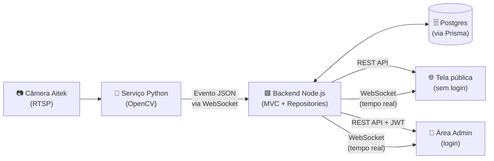
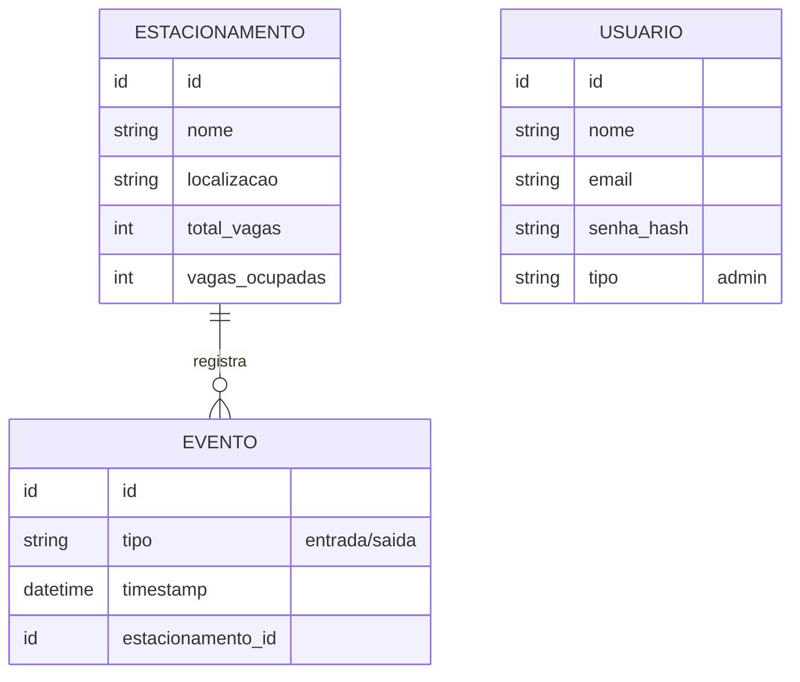
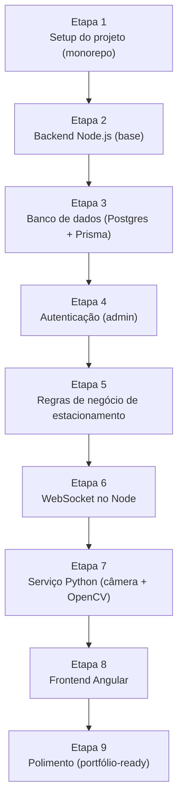

# 📑 Documento Central — Sistema de Estacionamento Inteligente

> Este documento é a **fonte única da verdade** do projeto. Qualquer IA ou colaborador que for trabalhar nesse sistema deve ler este documento inteiro antes de propor código, comando ou decisão. Nada aqui pode ser alterado sem autorização explícita do responsável pelo projeto (o autor deste documento).

---

## 📚 Sumário

1. [Contexto](#contexto)
2. [Ideia do Projeto](#ideia-do-projeto)
3. [Decisões já fechadas](#decisoes-fechadas)
4. [Fase de Teste — Câmera do Celular](#fase-de-teste)
5. [Requisitos Funcionais](#requisitos-funcionais)
6. [Requisitos Não Funcionais](#requisitos-nao-funcionais)
7. [Arquitetura de Domínio](#arquitetura-de-dominio)
8. [Modelagem das Tabelas](#modelagem-das-tabelas)
9. [Regras de Arquitetura](#regras-de-arquitetura)
10. [Comportamento da IA no Desenvolvimento](#comportamento-da-ia)
11. [Etapas de Construção](#etapas-de-construcao)
12. [Como usar este documento](#como-usar)

---

## 🎯 Contexto

Este projeto está sendo construído por um **aprendiz de engenharia de software fullstack**, como projeto de portfólio e aprendizado. Isso significa que quem for atuar como copiloto/IA no desenvolvimento deve:

- Explicar o **porquê** de cada decisão técnica, não só entregar o código pronto.
- Ensinar o conceito por trás do passo antes ou junto de executá-lo.
- Ir no ritmo do aprendiz: dividir em etapas pequenas e coerentes.
- Nunca assumir conhecimento prévio avançado sem confirmar.

---

## 🎯 Ideia do Projeto

Um estacionamento inteligente que usa uma **câmera real (modelo Aitek)** para detectar veículos entrando e saindo, atualizando o status das vagas em tempo real.

| Componente            | Responsabilidade                                                                                          |
| --------------------- | --------------------------------------------------------------------------------------------------------- |
| **Python (OpenCV)**   | Lê o stream da câmera (RTSP), processa a imagem, detecta entrada/saída de veículo e envia um evento.      |
| **Node.js**           | Recebe o evento, valida, aplica regra de negócio, persiste no banco e notifica o frontend em tempo real.  |
| **Angular**           | Mostra o status das vagas em tempo real. Tela pública para clientes (sem login) e área logada para admin. |
| **Postgres + Prisma** | Armazena eventos, estado do estacionamento e usuários (admin).                                            |

### Visão geral do fluxo

---

## ✅ Decisões já fechadas (não reabrir sem autorização)

| Tema                         | Decisão                                                                                                                                  |
| ---------------------------- | ---------------------------------------------------------------------------------------------------------------------------------------- |
| Câmera                       | Física, modelo **Aitek**, conexão via **RTSP** (`rtsp://usuario:senha@ip:porta/caminho` — URL exata a confirmar no manual/app da câmera) |
| Controle de vagas            | **Contador geral** (ex: `10 de 50 ocupadas`), não vaga individual                                                                        |
| Autenticação                 | **Somente admin loga** (JWT). Cliente acessa uma tela pública, sem login                                                                 |
| Comunicação Python → Node    | Via **WebSocket**, em tempo real                                                                                                         |
| Frontend → Backend           | API REST + WebSocket (para receber atualizações ao vivo)                                                                                 |
| Padrão de arquitetura (Node) | **MVC + Repositories**                                                                                                                   |
| ORM                          | **Prisma** sobre **Postgres**                                                                                                            |
| Validação                    | **Zod** nos controllers                                                                                                                  |
| Resiliência                  | Global error handler (o servidor nunca deve cair por exceção não tratada)                                                                |
| Câmera na fase de teste       | **Câmera de celular**, capturando os frames localmente, para evitar a complexidade de conexão RTSP/rede logo no início do projeto        |

---

## 🧪 Fase de Teste — Câmera do Celular

Enquanto o projeto ainda é pequeno, a captura dos frames será feita com a **câmera de um celular**, em vez da câmera Aitek via RTSP. O objetivo é evitar a complexidade de configuração de rede/conexão (IP, porta, RTSP, ONVIF etc.) nesta fase inicial, focando primeiro na lógica de detecção e no restante da arquitetura.

- **Toda a estrutura do sistema permanece igual**: o serviço Python (OpenCV) continua responsável por ler os frames, detectar entrada/saída de veículo e enviar o evento via WebSocket para o Node.js.
- A única diferença nesta fase é a **fonte da imagem**: os frames vêm da câmera do celular, e não de um stream RTSP da câmera Aitek.
- Quando o projeto crescer e a câmera Aitek estiver disponível/instalada, troca-se apenas a fonte de captura de frames no serviço Python — Node.js, banco e Angular não sofrem nenhuma alteração.
- Essa é uma decisão temporária de fase de teste, não uma mudança de arquitetura definitiva (a decisão fechada de câmera real via RTSP, descrita acima, continua valendo para quando o projeto crescer).
- **Simulação/mock de entrada e saída também é aceitável nesta fase.** Como nem sempre há acesso a carros reais passando pela câmera, o serviço Python pode disparar o evento manualmente (ex: apertando uma tecla pra simular "entrada" ou "saída") em vez de depender só de detecção real de movimento. Isso não muda nada do resto da arquitetura — o Node recebe o mesmo payload `{ tipo, estacionamento_id }` via WebSocket, seja ele originado de uma detecção real ou de um disparo manual/simulado.

---

## ✅ Requisitos Funcionais

- Detecção de veículos na entrada/saída via câmera real (Aitek, RTSP).
- Envio de eventos JSON do Python para o Node.js via WebSocket.
- Persistência dos eventos e do estado atual do estacionamento no banco.
- Atualização em tempo real do contador de vagas no frontend Angular.
- Autenticação JWT apenas para admin.
- Tela pública (sem login) para clientes verem vagas disponíveis.
- Validação de dados com Zod nos controllers.
- Logs estruturados para monitoramento.

---

## 🚫 Requisitos Não Funcionais

| Requisito            | Descrição                                                                             |
| -------------------- | ------------------------------------------------------------------------------------- |
| **Resiliência**      | Global error handler.                                                                 |
| **Escalabilidade**   | Arquitetura MVC + repositories.                                                       |
| **Segurança**        | JWT + middlewares de autorização (rotas de admin protegidas; rotas públicas abertas). |
| **Manutenibilidade** | Monorepo organizado (backend / frontend / serviço Python).                            |
| **Portfólio-ready**  | Boas práticas visíveis (logs, validação, error handling, código limpo, README claro). |

---

## 🧩 Arquitetura de Domínio

- **Estacionamento**: total de vagas e vagas ocupadas (contador).
- **Evento**: cada entrada/saída registrada (tipo + timestamp).
- **Usuário (admin)**: quem administra o sistema.
- **Previsão** _(opcional, fora do escopo inicial — só entra se autorizado depois)_.
- **Identificação por placa** _(opcional, fora do escopo inicial — ideia levantada em 2026-08-04: em vez de só contar veículos, reconhecer a placa na entrada/saída pra confirmar que é o mesmo veículo liberando a vaga. Fica pra depois da Etapa 7, quando já soubermos se a detecção básica funciona bem na câmera do celular — só entra se autorizado depois)_.

---

## 🗂️ Modelagem das Tabelas

- **Estacionamento** → `id`, `nome`, `localizacao`, `total_vagas`, `vagas_ocupadas`
- **Evento** → `id`, `tipo` (entrada/saida), `timestamp`, `estacionamento_id`
- **Usuário (admin)** → `id`, `nome`, `email`, `senha_hash`, `tipo` (admin)
- ~~Previsão~~ → fora do escopo inicial

---

## 🛠️ Regras de Arquitetura

1. Padrão **MVC + repositories**: controller (recebe request) → service (regra de negócio) → repository (acesso ao banco via Prisma).
2. Middlewares obrigatórios: autenticação JWT (rotas de admin), logger (auditoria), global error handler.
3. Validação de entrada com **Zod** em todo controller que recebe dados externos.
4. Comunicação Python → Node.js: WebSocket, payload em JSON (definir schema do evento na Etapa do Python).
5. Frontend Angular consome API REST para dados iniciais e escuta WebSocket para atualizações em tempo real.
6. Câmera Aitek conecta ao Python via RTSP; o Python é responsável por todo o processamento de imagem (Node.js não lida com imagem/vídeo).

---

## 🤖 Comportamento da IA no Desenvolvimento

- **Não inventar** decisões de arquitetura ou tecnologia fora do que está definido aqui.
- Seguir fielmente os requisitos e o stack já definidos nesta tabela de decisões fechadas.
- Dividir sempre o trabalho em **etapas pequenas e coerentes** (ex: instalar dependências → criar estrutura → implementar → testar).
- Sempre explicar o **porquê**, já que quem está construindo é um aprendiz.
- Fornecer comandos exatos, código completo e passos numerados — não deixar passos implícitos.
- **Sinalizar imediatamente** se o pedido do usuário estiver saindo do escopo definido neste documento (ex: sugestão de trocar Postgres por MongoDB, adicionar reconhecimento de placa sem ter sido pedido, etc.), explicando o desvio antes de agir.
- Qualquer mudança de arquitetura ou regra de negócio precisa ser **autorizada explicitamente** antes de ser aplicada — se não for autorizada, seguir o que já está documentado.
- Ao final de cada etapa, resumir o que foi feito e o que falta, para o aprendiz acompanhar o progresso.
- **Ao final de cada etapa, parar e aguardar.** Depois do resumo, dar espaço para o aprendiz trazer perguntas, dúvidas ou pedidos de ajuste sobre o que foi feito. Só marcar a etapa como encerrada (✅ no checklist) e seguir para a próxima depois que esse momento de perguntas for aberto e respondido — não emendar direto na etapa seguinte.
- **Testar só em pontos cruciais.** Focar teste (manual via curl ou automatizado) em lógica de negócio, autenticação e validações que realmente têm risco de quebrar — não parar o fluxo de trabalho para testar/reconfirmar coisas triviais ou que já foram validadas (ex: uma rota simples que já funcionou antes). O objetivo é manter o ritmo do desenvolvimento sem sacrificar a confiança nas partes que realmente importam.

---

## 🗺️ Etapas de Construção

> Ordem sugerida, mas não rígida — pode ser ajustada conforme necessidade, desde que dentro do escopo.

### Etapa 1 — Setup do projeto (monorepo)

- Criar estrutura de pastas (backend / frontend / camera-service)
- Iniciar repositório Git
- Configurar `.gitignore`, README inicial

### Etapa 2 — Backend Node.js (base)

- Instalar dependências (Express, Prisma, Zod, jsonwebtoken, ws, etc.)
- Criar estrutura de pastas (controllers, services, repositories, routes, middlewares)
- Configurar servidor Express básico
- Configurar middleware global de erro e logger

### Etapa 3 — Banco de dados (Postgres + Prisma)

- Configurar conexão com Postgres
- Modelar schema Prisma (Estacionamento, Evento, Usuário)
- Rodar primeira migration
- Seed inicial (ex: 1 estacionamento de teste)

### Etapa 4 — Autenticação (admin)

- Model de usuário admin
- Rota de login (gera JWT)
- Middleware de autenticação JWT
- Proteção das rotas administrativas

### Etapa 5 — Regras de negócio de estacionamento

- Endpoint para consultar status atual (vagas livres/ocupadas) — público
- Service que processa evento de entrada/saída e atualiza contador
- Repository de acesso ao Estacionamento e Evento

### Etapa 6 — WebSocket no Node

- Servidor WebSocket para receber eventos do Python
- Validação (Zod) do payload recebido
- Broadcast do novo status para os clientes Angular conectados

### Etapa 7 — Serviço Python (câmera + OpenCV)

- Fase de teste: capturar frames a partir da câmera de um celular (ver [Fase de Teste](#fase-de-teste))
- Loop de leitura de frames
- Lógica de detecção de veículo (entrada/saída)
- Cliente WebSocket enviando evento JSON para o Node
- Quando o projeto crescer: trocar a fonte de captura para a câmera Aitek via RTSP

### Etapa 8 — Frontend Angular

- Tela pública: status das vagas em tempo real (consome REST + WebSocket)
- Tela de login admin
- Área admin (histórico de eventos, configuração do estacionamento)

### Etapa 9 — Polimento (portfólio-ready)

- Logs estruturados revisados
- README completo com setup e prints
- Tratamento de erros revisado ponta a ponta
- (Opcional, só com autorização) Previsão de lotação

---

## 📌 Como usar este documento

Cole este documento inteiro no início da conversa com a IA que vai te ajudar a codar. Depois, diga em qual etapa você quer começar. A IA deve responder seguindo exatamente o que está aqui — e te avisar se algo que você pedir não bater com o que está documentado.
